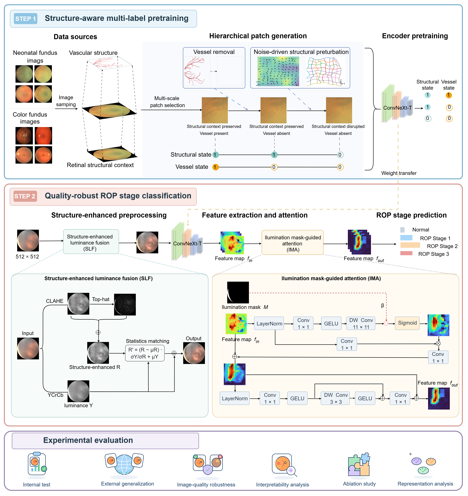

# Structure-Aware and Quality-Robust ROP Stage Classification

> A structure-aware pretraining and quality-robust four-class classification framework for Retinopathy of Prematurity (ROP).

<p align="center">
  
</p>

## Overview

This repository implements a four-class ROP stage classification framework using color fundus images.

The four categories are defined as follows:

| ID | Data Folder | Class |
| --- | --- | --- |
| 0 | `0normal` | Normal |
| 1 | `1Stage_1_ROP` | ROP Stage 1 |
| 2 | `2Stage_2_ROP` | ROP Stage 2 |
| 3 | `3Stage_3_ROP` | ROP Stage 3 |

The proposed framework consists of two main stages:

1. **Structure-Aware Multi-Label Pretraining**  
   Multi-scale image patches, vessel removal, and structural noise perturbations are used to learn retinal structural and vascular representations.

2. **Quality-Robust ROP Stage Classification**  
   Structure-enhanced Luminance Fusion (**SLF**) is used to enhance retinal structural information, while Illumination Mask-Guided Attention (**IMA**) is introduced to reduce the influence of highlights and illumination abnormalities.

An auxiliary **EfficientNet-B3 U-Net** is used to generate illumination masks.

The classification pipeline supports model training, evaluation, comprehensive metric calculation, and Grad-CAM visualization.

---

## Project Structure

```text
.
├── assets/
│   └── framework_overview.png       # Overview of the proposed framework
│
├── Data_classify/                   # Four-class ROP dataset
│   ├── train/
│   ├── val/
│   └── test/
│
├── Mask_generation/                 # Mask training, prediction, weights, and outputs
│   ├── train_mask.py
│   ├── test_mask.py
│   ├── weight/
│   └── mask_out/
│
├── Weight_pretrain/                 # Patch generation and multi-label pretraining
│   ├── Patch_generate.py
│   ├── network_multi_label.py
│   ├── train.py
│   └── out_weight_paper/
│
├── ROP_stage_classify/              # SLF, IMA, training, and evaluation
│   ├── dataset.py
│   ├── model.py
│   ├── engine.py
│   ├── main.py
│   ├── out_weight_paper/
│   └── output_dir/
│
├── requirements.txt
└── README.md
```

---

## Model Weights

| Purpose | Directory | Loading Method |
| --- | --- | --- |
| Illumination Mask U-Net | `Mask_generation/weight/` | Set `MODEL_WEIGHTS` in `test_mask.py` |
| Structure-Aware Pretraining | `Weight_pretrain/out_weight_paper/` | Load with `--finetune` |
| ROP Four-Class Classification | `ROP_stage_classify/out_weight_paper/` | Load with `--resume` |

The official pretrained and classification checkpoints will be released after the paper becomes publicly available.

---

## Environment Setup

Python **3.10** and an NVIDIA GPU with CUDA support are recommended.

The experiments were configured with PyTorch for **CUDA 11.8**.

```bash
conda create -n ropk python=3.10 -y
conda activate ropk

pip install torch torchvision torchaudio \
    --index-url https://download.pytorch.org/whl/cu118

pip install -r requirements.txt
```

---

## Data Preparation

The ROP classification dataset should follow the standard `ImageFolder` directory structure:

```text
Data_classify/
├── train/
│   ├── 0normal/
│   ├── 1Stage_1_ROP/
│   ├── 2Stage_2_ROP/
│   └── 3Stage_3_ROP/
│
├── val/
│   ├── 0normal/
│   ├── 1Stage_1_ROP/
│   ├── 2Stage_2_ROP/
│   └── 3Stage_3_ROP/
│
└── test/
    ├── 0normal/
    ├── 1Stage_1_ROP/
    ├── 2Stage_2_ROP/
    └── 3Stage_3_ROP/
```

The generated masks should mirror the image directory structure and use the same filename stem as the corresponding fundus images.

For example:

```text
Data_classify/train/0normal/case_001.jpg
Mask_generation/mask_out/train/0normal/case_001.png
```

---

## Usage

### 1. Generate Illumination Masks

Place the trained U-Net checkpoint in:

```text
Mask_generation/weight/
```

Then configure the following paths in `Mask_generation/test_mask.py`:

```python
MODEL_WEIGHTS = "./weight/best_unet_model.pth"
NEW_DATASET_ROOT = "../Data_classify/"
OUTPUT_ROOT = "./mask_out/"
```

Run mask generation:

```bash
cd Mask_generation
python test_mask.py
cd ..
```

The generated masks will be saved under:

```text
Mask_generation/mask_out/
```

If you want to train the mask-generation model from scratch, configure the following variables in `Mask_generation/train_mask.py`:

```text
TRAIN_IMG_DIR
TRAIN_MASK_DIR
OUTPUT_DIR
```

and then run:

```bash
cd Mask_generation
python train_mask.py
cd ..
```

---

### 2. Structure-Aware Pretraining (Optional)

The structure-aware pretraining stage requires paired fundus images and vessel annotations with matching filenames.

The source dataset should follow a structure similar to:

```text
<STRUCTURE_DATASET>/
├── training/
│   ├── images/
│   └── av/
│
└── test/
    ├── images/
    └── av/
```

Generate training patches:

```bash
python Weight_pretrain/Patch_generate.py \
    --dataset_path /path/to/data \
    --train_or_test training \
    --output ./Weight_pretrain/pretrain_data \
    --num_workers 8
```

Generate test patches:

```bash
python Weight_pretrain/Patch_generate.py \
    --dataset_path /path/to/data \
    --train_or_test test \
    --output ./Weight_pretrain/pretrain_data \
    --num_workers 8
```

The generated data can then be used for structure-aware multi-label pretraining.

The pretrained encoder checkpoint obtained from this stage can be loaded during ROP classification using:

```text
--finetune <PATH_TO_PRETRAINED_CHECKPOINT>
```

where `<PATH_TO_PRETRAINED_CHECKPOINT>` is the path to the structure-aware pretraining checkpoint.

---

### 3. Train the ROP Stage Classification Model

Run the following command from the repository root to train the four-class ROP classification model:

```bash
CUDA_VISIBLE_DEVICES=3 python ROP_stage_classify/main.py \
    --batch_size 16 \
    --world_size 1 \
    --epochs 50 \
    --blr 4e-3 \
    --weight_decay 0.05 \
    --nb_classes 4 \
    --data_path <PATH_TO_DATASET> \
    --mask_data_path <PATH_TO_MASK_DATASET> \
    --task <PATH_TO_OUTPUT_DIR> \
    --mixup 0.0 \
    --cutmix 0.0 \
    --warmup_epochs 10 \
    --min_lr 1e-6 \
    --drop_path 0.4 \
    --input_size 512 \
    --seed 4 \
    --finetune <PATH_TO_PRETRAINED_CHECKPOINT>
```

Replace the placeholders as follows:

- `<PATH_TO_DATASET>`: root directory of the ROP classification dataset.
- `<PATH_TO_MASK_DATASET>`: root directory of the corresponding illumination masks.
- `<PATH_TO_OUTPUT_DIR>`: directory used to save checkpoints, logs, and evaluation results.
- `<PATH_TO_PRETRAINED_CHECKPOINT>`: checkpoint obtained from the structure-aware pretraining stage.

For example:

```text
--data_path ./Data_classify/
--mask_data_path ./Mask_generation/mask_out/
--task ./ROP_stage_classify/output_dir/experiment_1/
--finetune ./Weight_pretrain/out_weight_paper/<PRETRAINED_CHECKPOINT>
```

The model with the best validation **AUC-ROC** is saved as:

```text
checkpoint-best_auc.pth
```

---

### 4. Evaluation

To evaluate a trained ROP classification model, run:

```bash
CUDA_VISIBLE_DEVICES=3 python ROP_stage_classify/main.py \
    --eval \
    --batch_size 16 \
    --world_size 1 \
    --epochs 50 \
    --blr 4e-3 \
    --weight_decay 0.05 \
    --nb_classes 4 \
    --data_path <PATH_TO_DATASET> \
    --mask_data_path <PATH_TO_MASK_DATASET> \
    --task <PATH_TO_OUTPUT_DIR> \
    --mixup 0.0 \
    --cutmix 0.0 \
    --warmup_epochs 10 \
    --min_lr 1e-6 \
    --drop_path 0.4 \
    --input_size 512 \
    --seed 4 \
    --resume <PATH_TO_CLASSIFICATION_CHECKPOINT>
```

Replace the placeholders as follows:

- `<PATH_TO_DATASET>`: root directory containing the test split.
- `<PATH_TO_MASK_DATASET>`: root directory containing the corresponding masks.
- `<PATH_TO_OUTPUT_DIR>`: directory used to save evaluation results.
- `<PATH_TO_CLASSIFICATION_CHECKPOINT>`: trained ROP classification checkpoint, typically `checkpoint-best_auc.pth`.

For example:

```text
--data_path ./Data_classify/
--mask_data_path ./Mask_generation/mask_out/
--task ./ROP_stage_classify/output_dir/experiment_1/test/
--resume ./ROP_stage_classify/out_weight_paper/checkpoint-best_auc.pth
```

---

### 5. Grad-CAM Visualization

To generate Grad-CAM visualizations for the test set, add:

```text
--visualize_gradcam
```

to the evaluation command.

For example:

```bash
CUDA_VISIBLE_DEVICES=3 python ROP_stage_classify/main.py \
    --eval \
    --batch_size 16 \
    --world_size 1 \
    --nb_classes 4 \
    --data_path <PATH_TO_DATASET> \
    --mask_data_path <PATH_TO_MASK_DATASET> \
    --task <PATH_TO_OUTPUT_DIR> \
    --input_size 512 \
    --seed 4 \
    --resume <PATH_TO_CLASSIFICATION_CHECKPOINT> \
    --visualize_gradcam
```

---

## Outputs

The evaluation pipeline reports and saves comprehensive classification results, including:

- Overall Accuracy
- Precision
- Recall
- Cohen's Kappa
- AUC-ROC
- AUC-PR
- F1 Score
- Matthews Correlation Coefficient (MCC)
- Per-class Accuracy
- Per-class AUC-ROC
- Per-class AUC-PR
- Image-level prediction probabilities
- Prediction CSV files
- Metric CSV files
- Confusion matrix
- Optional Grad-CAM visualizations

The SLF-enhanced images are cached under directories such as:

```text
Data_classify/.fused_cache_*/
```

---

## Important Notes

- `--nb_classes` **must be set to `4`** for the ROP classification task.
- `--task` must not be empty because it is used to save checkpoints, logs, metrics, and other outputs.
- It is recommended to use a trailing `/` for the `--task` directory.
- `--finetune` is used to load the encoder weights obtained from the structure-aware pretraining stage.
- `--resume` is used to load a complete ROP classification checkpoint.
- The image dataset and mask dataset should maintain the same directory hierarchy.
- Masks should use the same filename stem as their corresponding fundus images.
- If a mask is missing, the current pipeline replaces it with an all-zero mask. However, complete mask generation is recommended for reproducible evaluation.

---

## Paper

The associated paper has not yet been publicly released.

The publication information, official link, and related materials will be added after publication.

**Paper:** Coming soon.

---

## Pretrained Models

The pretrained checkpoints will be released upon publication of the paper.

**Download links:** Coming soon.
The following checkpoints will be released separately:

- Illumination mask generation model
- Structure-aware pretraining model
- ROP four-class classification model

---

## Citation

If you find this work useful for your research, please consider citing our paper.

The official BibTeX entry will be provided after the paper is publicly available.

```bibtex
@article{coming_soon,
  title   = {Coming Soon},
  author  = {Coming Soon},
  journal = {Coming Soon},
  year    = {Coming Soon}
}
```

---

## License

This project is released under the **MIT License**.
